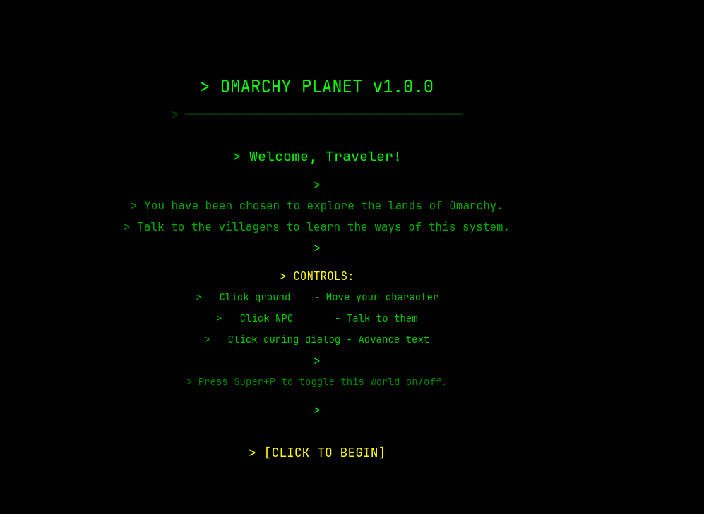
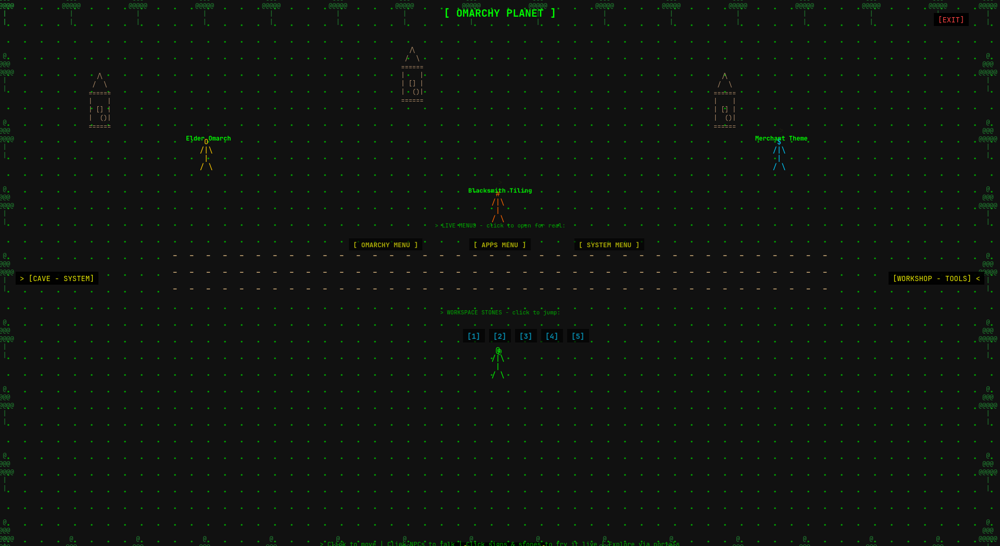
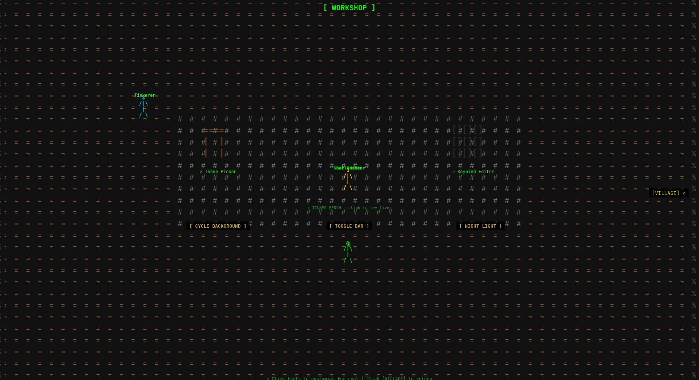

# Omarchy Planet

An ASCII/terminal-aesthetic RPG that lives at the wallpaper layer behind your windows, providing an interactive tour of Omarchy features via NPCs, dialog, and interactive objects.


*Explore the Village, talk to NPCs, and learn about Omarchy*

## Features

- **Interactive NPCs** with sequential dialog teaching Omarchy keybinds and features
- **4 explorable scenes**: Village, Forest (keybinds), Settings Cave (system), Workshop (themes/tools)
- **Terminal-style aesthetic**: green monospace text on dark background
- **Click-to-move** player character with ASCII sprites
- **Layer shell** integration: sits behind windows at the wallpaper layer
- **Toggle visibility** with `Super+Alt+P`
- **CSV-based dialog** for easy community contributions

## Screenshots

| | | |
|---|---|---|
|  |  |  |

## Installation

### Quick Install (Recommended)

```bash
# 1. Add the plugin
omarchy plugin add https://github.com/azzenabidi/omarchy-planet.git --enable

# 2. Run the install script (sets up dependencies + keybindings)
~/.config/omarchy/plugins/omarchy-planet/install.sh

# 3. Reload Hyprland
hyprctl reload
```

That's it! Press `Super+Alt+P` to launch Omarchy Planet.

### Manual Install

If you prefer to install manually:

```bash
# Clone the repo
git clone https://github.com/azzenabidi/omarchy-planet ~/.config/omarchy/plugins/omarchy-planet

# Install dependencies (Arch Linux)
sudo pacman -S python python-gobject webkitgtk-6.0 gtk4-layer-shell

# Make scripts executable
chmod +x ~/.config/omarchy/plugins/omarchy-planet/{toggle.py,stop.py,install.sh}

# Add keybindings to ~/.config/hypr/bindings.lua
cat >> ~/.config/hypr/bindings.lua << 'EOF'

-- Omarchy Planet RPG tour
o.bind("SUPER + ALT + P", "Omarchy Planet", "/usr/bin/python3 ~/.config/omarchy/plugins/omarchy-planet/toggle.py")
o.bind("SUPER + CTRL + P", "Omarchy Planet (Close)", "/usr/bin/python3 ~/.config/omarchy/plugins/omarchy-planet/stop.py")
EOF

# Reload Hyprland
hyprctl reload
```

## Usage

### Keybindings

| Keybind | Action |
|---------|--------|
| `Super+Alt+P` | Toggle Omarchy Planet on/off |
| `Super+Ctrl+P` | Force close Omarchy Planet |

### In-Game Controls

| Control | Action |
|---------|--------|
| Click ground | Move your character |
| Click NPCs | Start dialog sequence |
| Click dialog box | Advance through dialog lines |
| Click portals (yellow) | Travel between scenes |
| Click EXIT sign | Kill the game and return to desktop |

## Scenes

### Village (Hub)
The starting area where you meet friendly NPCs:

| NPC | Teaches |
|-----|---------|
| **Elder Omarch** | Workspaces, navigation, grouping |
| **Blacksmith Tiling** | Window management, resizing, shortcuts |
| **Merchant Theme** | Themes, menus, notifications, reminders |

### Forest (Keybinds)
7 signposts with every keyboard shortcut in Omarchy:
- Launching apps (18+ shortcuts)
- More apps (Spotify, Docker, Obsidian, etc.)
- AI & communication (ChatGPT, Signal, WhatsApp)
- Clipboard & input (copy, paste, emoji, calculator)
- Screenshots & recording (screenshot, record, OCR, dictation)
- Notifications & reminders
- System panels (audio, network, bluetooth, display, power)

### Settings Cave (System)
Learn about system configuration:

| NPC | Teaches |
|-----|---------|
| **Cave Guard** | Settings overview |
| **Network Keeper** | Networking, DNS, Tailscale, firewall |
| **Display Keeper** | Monitors, scaling, brightness, multi-monitor |

### Workshop (Tools)
Discover shell tools and customization:

| NPC | Teaches |
|-----|---------|
| **Tinkerer** | 22 built-in themes, backgrounds |
| **Shell Master** | fzf, zoxide, ripgrep, eza, fd, bat, tldr |
| **Bar Master** | Bar position, widgets, configuration |

## Contributing

### Adding Dialog

All dialog text is stored in `game/data/dialog.csv`. To add or modify content:

1. Edit `game/data/dialog.csv`
2. CSV format:
```csv
scene,id,type,name,line,text,recommendation
Village,new_npc,npc,NPC Name,1,"Dialog text here.",
Village,new_npc,npc,NPC Name,2,"More dialog.",Recommendation text here.
```

3. If adding a new NPC, update the scene file to position it

### Development

```bash
# Run tests
python3 tests/test_planet.py

# Restart the game
bash ~/.config/omarchy/plugins/omarchy-planet/restart.sh
```

## Architecture

```
omarchy-planet/
├── planet.py          # GTK4+WebKitGTK layer-shell container
├── toggle.py          # Start/toggle process
├── stop.py            # Kill process
├── restart.sh         # Restart helper
├── install.sh         # Installation script
├── manifest.json      # Omarchy plugin manifest
├── assets/            # Screenshots and images
├── game/
│   ├── index.html     # Phaser.js entry point
│   ├── data/
│   │   └── dialog.csv # All NPC/sign dialog (editable!)
│   └── js/
│       ├── main.js    # Phaser config
│       ├── scenes/    # Village, Forest, SettingsCave, Workshop
│       ├── entities/  # Player, NPC
│       └── systems/   # Dialog, DialogData, Bridge
└── tests/
    └── test_planet.py # 50 tests
```

## How This Was Built

### Why?

Omarchy is powerful but overwhelming for newcomers. The manual is great, but reading about keybinds isn't the same as discovering them. I wanted to create an interactive, fun way to learn Omarchy — an RPG that teaches you the system while you explore.

The idea: a terminal-aesthetic game that sits behind your windows like a living wallpaper. You click NPCs to learn keybinds, visit a forest of signposts, explore a cave for system settings, and workshop for tools. It's learn-by-doing, but for your entire desktop.

### Why These Technologies?

**GTK4 + WebKitGTK + Layer Shell (Python)**

Omarchy runs on Hyprland, a Wayland compositor. To sit behind windows, you need the [wlr-layer-shell protocol](https://wayland.app/protocols/wlr-layer-shell-unstable-v1). The only mature Python binding is `gtk4-layer-shell`, which pairs with GTK4 and WebKitGTK to render a web page as a layer surface.

Why not a native Wayland client? Because building an RPG engine from scratch in C would take months. WebKitGTK gives us a full browser engine — HTML5 Canvas, JavaScript, the works — inside a layer shell window. We get the best of both worlds: system-level window placement with web-level UI flexibility.

**Phaser.js (HTML5 Canvas)**

Phaser is a battle-tested 2D game engine. It handles sprites, scenes, input, physics, and tweens — everything needed for a simple RPG. Running inside WebKitGTK, it's just a web page. No plugins, no npm, no build step. Open `index.html` and it works.

**Why Python for the container?**

Python was the pragmatic choice:
- `gi` (GObject Introspection) bindings for GTK4 and WebKitGTK are mature on Arch Linux
- `gtk4-layer-shell` has Python bindings via `gi.require_version('Gtk4LayerShell', '1.0')`
- No compilation needed — just `pacman -S` the dependencies and run
- Easy to prototype, debug, and maintain

### Architecture Decisions

**The toggle problem**

Layer shell windows persist forever. To show/hide, we use a file-based signal (`/tmp/omarchy-planet-visible`). `toggle.py` writes "yes" or "no", `planet.py` polls every 300ms and sets window opacity accordingly. This avoids IPC complexity — just a file read/write between two processes.

**Why `LD_PRELOAD`?**

`gtk4-layer-shell` must be loaded before `libwayland-client` at process start. The `CDLL()` call in Python happens too late. Setting `LD_PRELOAD=/usr/lib/libgtk4-layer-shell.so` in the environment is the only reliable way to make layer shell work.

**BOTTOM layer, not BACKGROUND**

The Wayland layer-shell BACKGROUND layer doesn't receive pointer events by default — compositors assume background surfaces are non-interactive. We use the BOTTOM layer instead, which sits behind regular windows but still receives mouse clicks. Combined with `set_exclusive_zone(-1)`, the game doesn't reserve screen space.

**CSV-based dialog**

I wanted the community to contribute content without touching JavaScript. A CSV file (`dialog.csv`) with columns `scene,id,type,name,line,text,recommendation` lets anyone add NPCs or signs. The parser loads at boot, with hardcoded fallback data if the file fails to load (WebKitGTK's `fetch()` doesn't always work on `file://` protocol).

**No keyboard input**

Layer shell windows in `KeyboardMode.NONE` don't receive keyboard events. This is intentional — the game shouldn't steal keys from your terminal. All interaction is click-based: click to move, click NPCs, click dialog to advance.

**ASCII sprites via canvas**

Rather than shipping image assets, all sprites are generated at runtime using HTML5 Canvas. The `@` character is the player, `O` is the Elder, `#` is the Blacksmith, `$` is the Merchant. This keeps the pixel count tiny and reinforces the terminal aesthetic.

### Key Learnings

1. **Wayland layer shell is finicky.** Getting pointer events to work required switching from BACKGROUND to BOTTOM layer. Documentation is sparse — most answers come from reading Wayland protocol specs.

2. **`fetch()` on `file://` is unreliable.** WebKitGTK blocks cross-origin requests even for local files. Always have an XXHR fallback.

3. **`LD_PRELOAD` is required for gtk4-layer-shell.** The `CDLL()` approach doesn't work because the library must be loaded before libwayland-client.

4. **Phaser.js in WebKitGTK works surprisingly well.** Full Canvas/WebGL support, mouse events, tweens — everything just works inside the embedded browser.

5. **File-based IPC is underrated.** A 3-byte file (`yes`/`no`) is all you need to toggle a layer shell window. No sockets, no dbus, no complexity.

## Requirements

- Python 3
- GTK4
- WebKitGTK 6.0
- gtk4-layer-shell
- python-gobject

## License

MIT License - see [LICENSE](LICENSE) for details.

## Credits

Built for the [Omarchy](https://omarchy.org) community.
